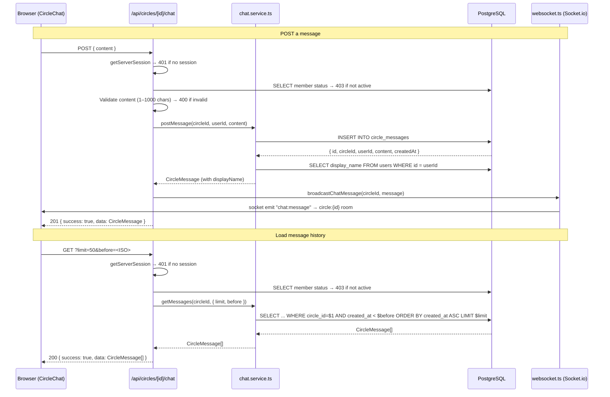
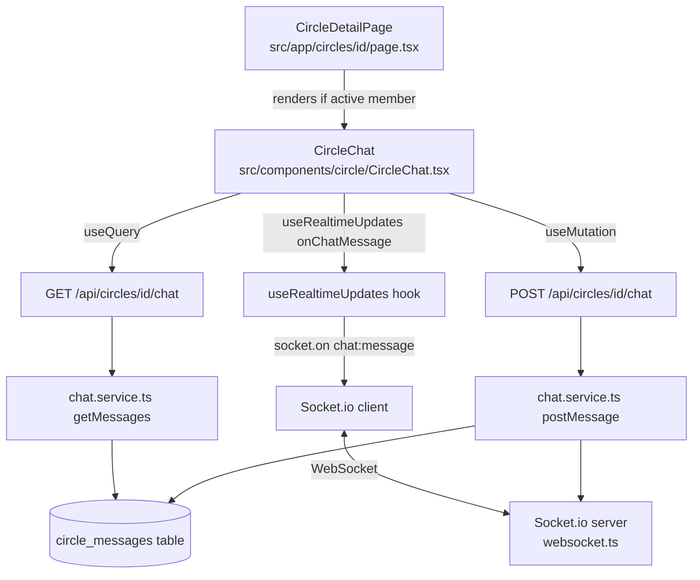

# Design Document: Circle Chat

## Overview

Circle Chat adds a persistent, real-time message thread to each savings circle. Members can coordinate payout timing, share updates, and communicate without leaving the app. The feature is scoped to active members only and integrates with the existing Socket.io WebSocket infrastructure, Next.js API route pattern, and React Query client-side data fetching.

The design follows the established patterns in the codebase:
- **Service layer**: parameterized SQL queries with camelCase column aliases (matching `circle.service.ts`)
- **API routes**: `withErrorHandler` + `withRateLimit` middleware, `getServerSession` auth, `ApiResponse<T>` shape (matching `contribute/route.ts`)
- **WebSocket**: `broadcastX()` functions emitting to `circle:{id}` rooms (matching `websocket.ts`)
- **Hook**: `socket.on(event, handler)` in `useEffect` with cleanup (matching `useRealtimeUpdates.ts`)
- **Components**: CSS Modules, TypeScript props, React Query for data fetching (matching `CircleCard.tsx`)

### Key Design Decisions

1. **Cursor-based pagination over offset**: Using `before` (ISO timestamp) as a cursor avoids the "page drift" problem where new messages shift offset-based pages. The query `WHERE created_at < $before ORDER BY created_at ASC LIMIT $limit` is stable and index-friendly.

2. **WebSocket broadcast on POST success**: The API route calls `broadcastChatMessage()` after the DB insert succeeds. The sender's own UI also receives the event via the socket subscription, so the optimistic-update pattern is not needed — the message appears via the real-time path for all clients including the sender.

3. **Author `display_name` joined at query time**: Rather than storing `display_name` in `circle_messages`, the service JOINs `users` on every read. This keeps the data normalized and ensures display name changes are reflected immediately.

4. **Rate limiting on POST only**: The `withRateLimit` wrapper (30 req/min per IP) is applied only to POST. GET requests are read-only and already protected by the active-member check.

5. **Content validation at API layer**: The API validates `content` length (1–1000 chars) before hitting the DB. The DB constraint is a safety net, not the primary enforcement point.

---

## Architecture



### Component Interaction Diagram



---

## Components and Interfaces

### New Files

| File | Purpose |
|------|---------|
| `migrations/<timestamp>_add-circle-messages-table.ts` | Creates `circle_messages` table with index |
| `src/server/services/chat.service.ts` | `postMessage()`, `getMessages()` — DB access layer |
| `src/app/api/circles/[id]/chat/route.ts` | GET + POST handlers |
| `src/components/circle/CircleChat.tsx` | Client component: message list + input |
| `src/components/circle/CircleChat.module.css` | Scoped styles for CircleChat |

### Modified Files

| File | Change |
|------|--------|
| `src/types/index.ts` | Add `CircleMessage` type |
| `src/server/websocket.ts` | Add `chat:message` to `WebSocketEvents`; add `broadcastChatMessage()` |
| `src/hooks/useRealtimeUpdates.ts` | Add `onChatMessage` option |
| `src/app/circles/[id]/page.tsx` | Render `<CircleChat>` for active members |

### `CircleMessage` Type

```typescript
// src/types/index.ts
export interface CircleMessage {
  id: string;
  circleId: string;
  userId: string;
  displayName: string;   // joined from users table at read time
  content: string;
  createdAt: string;     // ISO 8601 string
}
```

### `WebSocketEvents` Addition

```typescript
// src/server/websocket.ts
export interface WebSocketEvents {
  // ... existing events ...
  "chat:message": {
    id: string;
    circleId: string;
    userId: string;
    displayName: string;
    content: string;
    createdAt: string;
  };
}
```

### `broadcastChatMessage()` Function

```typescript
export function broadcastChatMessage(
  circleId: string,
  message: WebSocketEvents["chat:message"]
): void {
  if (!io) return;
  io.to(`circle:${circleId}`).emit("chat:message", message);
  console.log(`[websocket] Broadcasted chat:message to circle:${circleId}`);
}
```

### `useRealtimeUpdates` Hook Addition

```typescript
interface UseRealtimeUpdatesOptions {
  // ... existing options ...
  onChatMessage?: (data: WebSocketEvents["chat:message"]) => void;
}
// Inside useEffect:
if (onChatMessage) {
  socket.on("chat:message", onChatMessage);
}
```

### Chat Service Interface

```typescript
// src/server/services/chat.service.ts

export interface GetMessagesOptions {
  limit?: number;   // 1–100, default 50
  before?: string;  // ISO 8601 timestamp cursor
}

export async function postMessage(
  circleId: string,
  userId: string,
  content: string
): Promise<CircleMessage>

export async function getMessages(
  circleId: string,
  options?: GetMessagesOptions
): Promise<CircleMessage[]>
```

### API Route Interface

```
GET  /api/circles/[id]/chat?limit=50&before=<ISO>
  → 200 ApiResponse<CircleMessage[]>
  → 401 if no session
  → 403 if not active member

POST /api/circles/[id]/chat
  Body: { content: string }
  → 201 ApiResponse<CircleMessage>
  → 400 if content missing/empty/too long
  → 401 if no session
  → 403 if not active member
  → 429 if rate limited (30 req/min per IP)
```

### `CircleChat` Component Props

```typescript
interface CircleChatProps {
  circleId: string;
  isActiveMember: boolean;
  currentUserId: string;
}
```

---

## Data Models

### `circle_messages` Table

```sql
CREATE TABLE circle_messages (
  id          UUID        PRIMARY KEY DEFAULT gen_random_uuid(),
  circle_id   UUID        NOT NULL REFERENCES circles(id) ON DELETE CASCADE,
  user_id     VARCHAR(255) NOT NULL REFERENCES users(id) ON DELETE CASCADE,
  content     TEXT        NOT NULL
                CHECK (char_length(content) >= 1 AND char_length(content) <= 1000),
  created_at  TIMESTAMP   NOT NULL DEFAULT NOW()
);

CREATE INDEX idx_circle_messages_circle_created
  ON circle_messages (circle_id, created_at);
```

### Migration File

Timestamp: `1746200000000` (next in sequence after `1746100000000`)

```typescript
// migrations/1746200000000_add-circle-messages-table.ts
import { MigrationBuilder } from "node-pg-migrate";

export async function up(pgm: MigrationBuilder): Promise<void> {
  pgm.createTable("circle_messages", {
    id: { type: "uuid", primaryKey: true, default: pgm.func("gen_random_uuid()") },
    circle_id: {
      type: "uuid",
      notNull: true,
      references: "circles(id)",
      onDelete: "CASCADE",
    },
    user_id: {
      type: "varchar(255)",
      notNull: true,
      references: "users(id)",
      onDelete: "CASCADE",
    },
    content: {
      type: "text",
      notNull: true,
      check: "char_length(content) >= 1 AND char_length(content) <= 1000",
    },
    created_at: {
      type: "timestamp",
      notNull: true,
      default: pgm.func("NOW()"),
    },
  });

  pgm.createIndex("circle_messages", ["circle_id", "created_at"], {
    name: "idx_circle_messages_circle_created",
  });
}

export async function down(pgm: MigrationBuilder): Promise<void> {
  pgm.dropTable("circle_messages");
}
```

### Chat Service SQL Queries

**`postMessage`** — insert and return with display_name:
```sql
INSERT INTO circle_messages (circle_id, user_id, content)
VALUES ($1, $2, $3)
RETURNING
  id,
  circle_id   AS "circleId",
  user_id     AS "userId",
  content,
  created_at  AS "createdAt"
```
Followed by a JOIN to fetch `display_name`:
```sql
SELECT
  cm.id,
  cm.circle_id   AS "circleId",
  cm.user_id     AS "userId",
  u.display_name AS "displayName",
  cm.content,
  cm.created_at  AS "createdAt"
FROM circle_messages cm
JOIN users u ON u.id = cm.user_id
WHERE cm.id = $1
```

**`getMessages`** — cursor-based pagination:
```sql
SELECT
  cm.id,
  cm.circle_id   AS "circleId",
  cm.user_id     AS "userId",
  u.display_name AS "displayName",
  cm.content,
  cm.created_at  AS "createdAt"
FROM circle_messages cm
JOIN users u ON u.id = cm.user_id
WHERE cm.circle_id = $1
  AND ($2::timestamp IS NULL OR cm.created_at < $2)
ORDER BY cm.created_at ASC
LIMIT $3
```

---

## Correctness Properties

*A property is a characteristic or behavior that should hold true across all valid executions of a system — essentially, a formal statement about what the system should do. Properties serve as the bridge between human-readable specifications and machine-verifiable correctness guarantees.*

The project already includes `fast-check@4.6.0` as a dev dependency, making it the natural choice for property-based testing.

### Property Reflection

Before writing properties, reviewing the prework for redundancy:

- **2.2 and 3.2 and 6.2** all test "non-active member gets 403". These can be unified into one property: for any request (GET or POST) from a user with non-active membership status, the API returns 403.
- **2.4 and 1.2** both test content length enforcement. They can be unified: the system rejects content outside [1, 1000] chars.
- **3.3 and 3.5** are related but distinct: ordering (3.3) and cursor filtering (3.5) are separate invariants worth keeping separate.
- **5.3 and 5.5** are UI properties that are independent — form clearing vs. scroll behavior.
- **7.2 and 7.3 and 7.4** are pagination UI properties that are independent.

After reflection, the consolidated set of properties is:

---

### Property 1: Content length enforcement

*For any* string submitted as `content` in a POST request by an active member, the request SHALL succeed (HTTP 201) if and only if the content length is between 1 and 1000 characters inclusive. Any content outside this range SHALL be rejected with HTTP 400.

**Validates: Requirements 1.2, 2.3, 2.4**

---

### Property 2: Author identity round-trip

*For any* valid `userId` and `content`, after `postMessage(circleId, userId, content)` succeeds, the returned `CircleMessage.userId` SHALL equal the original `userId` exactly.

**Validates: Requirements 1.3, 2.5**

---

### Property 3: Active-member access control

*For any* user whose `members` row for the given circle has a status other than `'active'` (i.e., `'pending'`, `'rejected'`, `'defaulted'`, or `'completed'`), both GET and POST requests to `/api/circles/[id]/chat` SHALL return HTTP 403.

**Validates: Requirements 2.2, 3.2, 6.2**

---

### Property 4: Chronological ordering invariant

*For any* set of messages stored in `circle_messages` for a given circle, the array returned by `getMessages(circleId)` SHALL be sorted in strictly ascending order by `createdAt` (oldest first).

**Validates: Requirements 3.3**

---

### Property 5: Cursor pagination correctness

*For any* ISO 8601 timestamp `before` and any set of messages in the database, every message returned by `getMessages(circleId, { before })` SHALL have `createdAt` strictly less than `before`.

**Validates: Requirements 3.5**

---

### Property 6: Limit parameter enforcement

*For any* integer `limit` in [1, 100], the array returned by `getMessages(circleId, { limit })` SHALL contain at most `limit` messages. When `limit` is omitted, the response SHALL contain at most 50 messages.

**Validates: Requirements 3.4**

---

### Property 7: Response includes display_name

*For any* message returned by `getMessages()` or `postMessage()`, the `CircleMessage` object SHALL include a non-null, non-empty `displayName` field matching the `display_name` of the message author in the `users` table.

**Validates: Requirements 3.6, 4.1**

---

### Property 8: WebSocket broadcast payload completeness

*For any* successfully persisted message, the payload passed to `broadcastChatMessage()` SHALL contain all required fields: `id`, `circleId`, `userId`, `displayName`, `content`, and `createdAt`, each with a non-null value.

**Validates: Requirements 4.1, 2.6**

---

### Property 9: UI appends incoming real-time messages

*For any* `chat:message` WebSocket event received while the `CircleChat` component is mounted, the message SHALL be appended to the end of the displayed message list, and the list length SHALL increase by exactly one.

**Validates: Requirements 4.3**

---

### Property 10: Pagination cursor uses oldest visible message

*For any* non-empty set of messages currently displayed in `CircleChat`, when the "Load earlier messages" control is activated, the GET request SHALL include a `before` query parameter equal to the `createdAt` of the oldest (first) message in the current list.

**Validates: Requirements 7.2**

---

### Property 11: Load-more control visibility

*For any* GET response, the "Load earlier messages" control SHALL be visible if and only if the number of messages returned equals the requested `limit`. When the response contains fewer messages than `limit`, the control SHALL be hidden.

**Validates: Requirements 7.4**

---

## Error Handling

### API Layer

| Condition | HTTP Status | Error Code | Response |
|-----------|-------------|------------|----------|
| No session | 401 | `UNAUTHORIZED` | `{ success: false, error: "Unauthorized" }` |
| User not active member | 403 | `FORBIDDEN` | `{ success: false, error: "Not an active member of this circle" }` |
| Circle not found | 404 | `NOT_FOUND` | `{ success: false, error: "Circle not found" }` |
| Missing/empty content | 400 | `VALIDATION_ERROR` | `{ success: false, error: "content is required and must not be empty" }` |
| Content > 1000 chars | 400 | `VALIDATION_ERROR` | `{ success: false, error: "content must not exceed 1000 characters" }` |
| Invalid `limit` param | 400 | `VALIDATION_ERROR` | `{ success: false, error: "limit must be an integer between 1 and 100" }` |
| Invalid `before` param | 400 | `VALIDATION_ERROR` | `{ success: false, error: "before must be a valid ISO 8601 timestamp" }` |
| Rate limit exceeded | 429 | `RATE_LIMITED` | `{ success: false, error: "Too many requests" }` |
| DB / unexpected error | 500 | `INTERNAL_ERROR` | `{ success: false, error: "Internal server error" }` |

All errors are wrapped by `withErrorHandler`, which logs via Pino and reports to Sentry.

### Service Layer

- `postMessage` throws if the DB insert fails (e.g., FK violation, constraint violation). The API route's `withErrorHandler` catches and returns 500.
- `getMessages` throws on DB errors. Same handling.
- Neither function swallows errors — they propagate to the API layer for consistent error handling.

### WebSocket Layer

- `broadcastChatMessage` is a fire-and-forget call. If `io` is null (server not initialized), it returns silently. This is consistent with the existing broadcast functions.
- A failed broadcast does NOT roll back the DB insert. The message is persisted; the real-time delivery is best-effort. Clients will see the message on next page load or GET poll.

### Client Layer

- React Query's `isError` / `error` states are surfaced as inline error messages in `CircleChat`.
- A failed POST does not clear the input field, allowing the user to retry.
- A failed GET shows an error message with a retry option.
- WebSocket disconnection is handled by the existing `useRealtimeUpdates` hook (sets `isConnected: false`). The UI degrades gracefully — messages still load via HTTP.

---

## Testing Strategy

### Unit Tests (Jest + `@testing-library/react`)

**`chat.service.ts`**:
- `postMessage` with valid inputs returns a `CircleMessage` with correct fields
- `postMessage` with content at boundary (1 char, 1000 chars) succeeds
- `getMessages` with no options returns up to 50 messages in ascending order
- `getMessages` with `before` cursor excludes messages at or after the timestamp
- `getMessages` with `limit` respects the limit

**`/api/circles/[id]/chat/route.ts`**:
- GET without session → 401
- GET with non-active member → 403
- GET with active member → 200 with messages array
- POST without session → 401
- POST with non-active member → 403
- POST with empty content → 400
- POST with content > 1000 chars → 400
- POST with valid content → 201 with created message; `broadcastChatMessage` called

**`CircleChat.tsx`**:
- Renders message list, input, and send button for active members
- Renders read-only notice for non-members
- Shows loading indicator while fetching
- Shows error message on fetch failure
- Disables send button while POST is in flight
- Clears input on successful POST

### Property-Based Tests (fast-check)

Each property test runs a minimum of 100 iterations. Tests are tagged with the feature and property number.

```typescript
// Feature: circle-chat, Property 1: Content length enforcement
fc.assert(fc.property(
  fc.string({ minLength: 1001, maxLength: 5000 }),
  async (content) => {
    const res = await POST({ content }, activeMemberSession);
    expect(res.status).toBe(400);
  }
), { numRuns: 100 });

fc.assert(fc.property(
  fc.string({ minLength: 1, maxLength: 1000 }),
  async (content) => {
    const res = await POST({ content }, activeMemberSession);
    expect(res.status).toBe(201);
  }
), { numRuns: 100 });
```

```typescript
// Feature: circle-chat, Property 2: Author identity round-trip
fc.assert(fc.property(
  fc.string({ minLength: 1, maxLength: 1000 }),
  async (content) => {
    const message = await postMessage(circleId, userId, content);
    expect(message.userId).toBe(userId);
  }
), { numRuns: 100 });
```

```typescript
// Feature: circle-chat, Property 4: Chronological ordering invariant
fc.assert(fc.property(
  fc.array(fc.record({ content: fc.string({ minLength: 1, maxLength: 100 }) }), { minLength: 2, maxLength: 20 }),
  async (messageDefs) => {
    // Insert messages with varying timestamps
    const messages = await getMessages(circleId);
    const timestamps = messages.map(m => new Date(m.createdAt).getTime());
    for (let i = 1; i < timestamps.length; i++) {
      expect(timestamps[i]).toBeGreaterThanOrEqual(timestamps[i - 1]);
    }
  }
), { numRuns: 100 });
```

```typescript
// Feature: circle-chat, Property 5: Cursor pagination correctness
fc.assert(fc.property(
  fc.date({ min: new Date('2020-01-01'), max: new Date('2030-01-01') }),
  async (before) => {
    const messages = await getMessages(circleId, { before: before.toISOString() });
    for (const msg of messages) {
      expect(new Date(msg.createdAt).getTime()).toBeLessThan(before.getTime());
    }
  }
), { numRuns: 100 });
```

```typescript
// Feature: circle-chat, Property 6: Limit parameter enforcement
fc.assert(fc.property(
  fc.integer({ min: 1, max: 100 }),
  async (limit) => {
    const messages = await getMessages(circleId, { limit });
    expect(messages.length).toBeLessThanOrEqual(limit);
  }
), { numRuns: 100 });
```

```typescript
// Feature: circle-chat, Property 7: Response includes display_name
fc.assert(fc.property(
  fc.string({ minLength: 1, maxLength: 1000 }),
  async (content) => {
    const message = await postMessage(circleId, userId, content);
    expect(message.displayName).toBeTruthy();
    expect(typeof message.displayName).toBe('string');
  }
), { numRuns: 100 });
```

### Integration Tests

- End-to-end: POST a message → verify it appears in subsequent GET response
- WebSocket: POST a message → verify `chat:message` event is emitted to the circle room (using a test socket client)
- Rate limiting: 31 POST requests from same IP within 60s → 31st returns 429

### Migration Test

- Run `up()` migration → verify `circle_messages` table exists with correct columns and index
- Run `down()` migration → verify table is dropped
