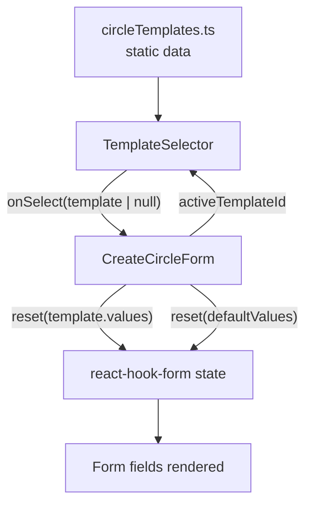

# Design Document: Circle Templates

## Overview

This feature adds a Template Selector UI above the existing Create Circle form at `/circles/create`. Templates are static, frontend-only presets that pre-fill all form fields with sensible defaults. The user can select a template to start from, edit any field freely, switch templates, or choose a blank option to use the form's original defaults.

No backend changes are required. The entire feature lives in the frontend: a static data file, a new `TemplateSelector` component, and a small integration with the existing `CreateCircleForm`.

### Key Design Decisions

- **Static data file** — templates are defined in `src/data/circleTemplates.ts`. Adding or changing a template requires only editing that file.
- **`reset()` from react-hook-form** — the form already uses `react-hook-form`. Applying a template calls `reset(templateValues)`, which atomically replaces all field values and clears validation errors. This is the idiomatic approach and avoids manual `setValue` calls for each field.
- **Controlled active-template state lives in `CreateCircleForm`** — the form owns the selected template ID so it can pass it down to `TemplateSelector` for visual feedback and react to selection changes.
- **Blank option resets to original defaults** — selecting "blank" calls `reset(defaultValues)` with the same defaults the form was initialised with, restoring the form to its initial state.

---

## Architecture

The feature is entirely client-side. No new routes, API endpoints, or database changes are needed.

```
src/
├── data/
│   └── circleTemplates.ts          # Static template definitions (new)
├── components/
│   └── circle/
│       ├── TemplateSelector.tsx    # New component
│       ├── TemplateSelector.module.css
│       └── CreateCircleForm.tsx    # Modified: integrates TemplateSelector
```

### Data Flow



The `CreateCircleForm` holds `activeTemplateId` in local state. When the user picks a template, `onSelect` fires, the form calls `reset()` with the template's values, and passes the new `activeTemplateId` back to `TemplateSelector` so it can render the active indicator.

---

## Components and Interfaces

### `CircleTemplate` (data type)

```typescript
// src/data/circleTemplates.ts

export interface CircleTemplate {
  id: string;                          // unique slug, e.g. "family-monthly-ngn"
  name: string;                        // display name, e.g. "Family Monthly"
  description: string;                 // short human-readable summary
  values: {
    name: string;                      // suggested circle name
    contributionAmount: number;
    contributionCurrency: "NGN" | "GBP" | "USD" | "EUR";
    maxMembers: number;
    cycleFrequency: "weekly" | "biweekly" | "monthly";
    circleType: "public" | "private";
    payoutMethod: "fixed" | "randomized";
  };
}
```

### `TemplateSelector` component

```typescript
// src/components/circle/TemplateSelector.tsx

interface TemplateSelectorProps {
  templates: CircleTemplate[];
  activeTemplateId: string | null;     // null = blank/no template
  onSelect: (template: CircleTemplate | null) => void;
}
```

Renders a horizontal scrollable row of template cards plus a "Blank" card. Each card shows the template name, currency, contribution amount, member count, and cycle frequency. The active card receives an `aria-pressed="true"` attribute and a distinct visual style (border highlight).

### `CreateCircleForm` changes

- Import `TemplateSelector` and `CIRCLE_TEMPLATES`.
- Add `const [activeTemplateId, setActiveTemplateId] = useState<string | null>(null)`.
- Extract `defaultValues` as a named constant so it can be reused in the blank-reset path.
- Add `handleTemplateSelect(template: CircleTemplate | null)`:
  - If `template` is non-null: `reset(template.values); setActiveTemplateId(template.id)`.
  - If `template` is null (blank): `reset(defaultValues); setActiveTemplateId(null)`.
- Render `<TemplateSelector>` above the form fields.

---

## Data Models

### Static template definitions

```typescript
// src/data/circleTemplates.ts

export const CIRCLE_TEMPLATES: CircleTemplate[] = [
  {
    id: "family-monthly-ngn",
    name: "Family Monthly",
    description: "₦20,000 · 10 members · Monthly",
    values: {
      name: "Family Monthly Ajo",
      contributionAmount: 20000,
      contributionCurrency: "NGN",
      maxMembers: 10,
      cycleFrequency: "monthly",
      circleType: "public",
      payoutMethod: "fixed",
    },
  },
  {
    id: "friends-weekly-ngn",
    name: "Friends Weekly",
    description: "₦5,000 · 5 members · Weekly",
    values: {
      name: "Friends Weekly Ajo",
      contributionAmount: 5000,
      contributionCurrency: "NGN",
      maxMembers: 5,
      cycleFrequency: "weekly",
      circleType: "public",
      payoutMethod: "fixed",
    },
  },
  {
    id: "diaspora-monthly-gbp",
    name: "Diaspora Monthly",
    description: "£100 · 8 members · Monthly",
    values: {
      name: "Diaspora Monthly Ajo",
      contributionAmount: 100,
      contributionCurrency: "GBP",
      maxMembers: 8,
      cycleFrequency: "monthly",
      circleType: "private",
      payoutMethod: "fixed",
    },
  },
  {
    id: "small-group-biweekly-ngn",
    name: "Small Group",
    description: "₦10,000 · 4 members · Bi-weekly",
    values: {
      name: "Small Group Ajo",
      contributionAmount: 10000,
      contributionCurrency: "NGN",
      maxMembers: 4,
      cycleFrequency: "biweekly",
      circleType: "public",
      payoutMethod: "fixed",
    },
  },
];
```

This gives 4 templates: two NGN monthly/weekly, one GBP monthly, one NGN bi-weekly — satisfying the requirement for at least one NGN, one GBP, and one monthly template.

### Form default values (extracted constant)

```typescript
const FORM_DEFAULTS: CreateCircleInput = {
  name: "",
  contributionAmount: undefined as unknown as number,
  contributionCurrency: "NGN",
  maxMembers: undefined as unknown as number,
  cycleFrequency: "monthly",
  circleType: "public",
  payoutMethod: "fixed",
};
```

---

## Correctness Properties

*A property is a characteristic or behavior that should hold true across all valid executions of a system — essentially, a formal statement about what the system should do. Properties serve as the bridge between human-readable specifications and machine-verifiable correctness guarantees.*

### Property 1: Template count is within bounds

*For any* valid `CIRCLE_TEMPLATES` array, its length SHALL be greater than or equal to 3 and less than or equal to 5.

**Validates: Requirements 1.1**

---

### Property 2: Every template card renders all required metadata

*For any* template in `CIRCLE_TEMPLATES`, when `TemplateSelector` renders that template, the rendered output SHALL contain the template's name, contribution amount, currency, member count, and cycle frequency.

**Validates: Requirements 1.3**

---

### Property 3: Selecting a template populates all form fields

*For any* template in `CIRCLE_TEMPLATES`, when a user selects that template, all form fields (name, contributionAmount, contributionCurrency, maxMembers, cycleFrequency, circleType, payoutMethod) SHALL equal the corresponding values from the template.

**Validates: Requirements 2.1, 2.2, 2.3, 2.4, 2.5, 2.6, 2.7**

---

### Property 4: Active template is visually indicated

*For any* template in `CIRCLE_TEMPLATES`, after a user selects that template, the corresponding template card SHALL have `aria-pressed="true"` and all other cards (including blank) SHALL have `aria-pressed="false"`.

**Validates: Requirements 2.8**

---

### Property 5: Switching templates overwrites all fields

*For any* two distinct templates A and B in `CIRCLE_TEMPLATES`, after selecting A and then selecting B, all form fields SHALL equal B's values (not A's).

**Validates: Requirements 3.3**

---

### Property 6: Selecting blank resets to original defaults

*For any* template in `CIRCLE_TEMPLATES`, after selecting that template and then selecting the blank option, all form fields SHALL equal the original `FORM_DEFAULTS` values.

**Validates: Requirements 4.3**

---

## Error Handling

This feature introduces no new error states. All template data is static and always available. The only failure modes are inherited from the existing form:

- **Validation errors** — react-hook-form + zod handle these. Calling `reset()` with a template's values clears any prior validation errors, so the user starts fresh after selecting a template.
- **API errors on submit** — unchanged from the existing form.

One edge case to handle: if a template's `contributionAmount` or `maxMembers` value falls outside the zod schema's min/max bounds, the form will show a validation error on submit. The static template data must be validated against the schema constraints at definition time (enforced by TypeScript typing against `CreateCircleInput`).

---

## Testing Strategy

The project uses **Jest** with **@testing-library/react** for unit and component tests. There is no property-based testing library currently installed.

### Unit / Component Tests

These cover specific examples, edge cases, and the correctness properties above using concrete template data.

**`src/data/circleTemplates.test.ts`** — data integrity tests:
- Template count is between 3 and 5 (Property 1)
- At least one NGN template, one GBP template, one monthly template (Requirement 1.4)
- Every template's `values` satisfies `createCircleSchema` (no invalid presets)

**`src/components/circle/__tests__/TemplateSelector.test.tsx`** — component tests:
- Renders all templates from the data array (Property 2 — name, amount, currency, members, frequency visible)
- Renders a "Blank" option
- Calls `onSelect` with the correct template when a card is clicked (Property 3 precondition)
- Calls `onSelect(null)` when the blank card is clicked
- Active card has `aria-pressed="true"`, others have `aria-pressed="false"` (Property 4)
- No network request is made during render (Requirement 5.1 / 5.2)

**`src/components/circle/__tests__/CreateCircleForm.test.tsx`** — integration tests (extending existing file):
- Selecting a template populates all form fields (Property 3)
- Selecting template A then template B overwrites all fields with B's values (Property 5)
- Selecting a template then blank resets all fields to defaults (Property 6)
- Fields remain editable after template selection (Requirement 3.1)
- Edited field value is retained after editing (Requirement 3.2)
- Form submits the user's final values after template selection and field edit (Requirement 3.4)

### Why PBT is not used

The project has no property-based testing library installed (no fast-check, hypothesis, etc.), and the input space for this feature is small and finite — there are at most 5 static templates. The correctness properties above are fully covered by iterating over the concrete template array in standard Jest tests. Adding a PBT library would be disproportionate to the scope of this feature.
