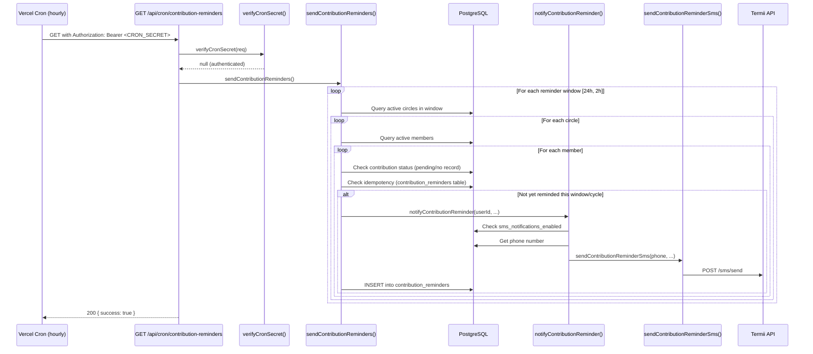

# Design Document: Contribution Reminders

## Overview

This feature adds automated SMS reminders to Ajosave that prompt active circle members to contribute before the cycle deadline (`next_payout_at`). Two reminder windows are supported: 24 hours before the deadline and 2 hours before the deadline. The system is designed to be idempotent — each member receives at most one reminder per window per cycle, regardless of how many times the cron runs while the circle is inside a window.

The implementation extends the existing cron-based notification infrastructure without modifying any existing endpoints or services. It introduces:

- A new `sendContributionReminderSms` function in `src/lib/sms.ts`
- A new `notifyContributionReminder` function in `src/server/services/notification.service.ts`
- A new `sendContributionReminders` function in `src/server/services/scheduler.service.ts`
- A new cron endpoint at `src/app/api/cron/contribution-reminders/route.ts`
- A new `contribution_reminders` database table for idempotency tracking
- A migration file to create the idempotency table

### Key Design Decisions

**Idempotency via a dedicated tracking table** — The requirements mandate at most one reminder per window per member per cycle. The cleanest approach is a `contribution_reminders` table with a unique constraint on `(member_id, cycle_number, reminder_type)`. This is preferred over adding columns to the `contributions` table (which conflates two concerns) and over relying on contribution record status (which doesn't exist for members who haven't initiated payment yet).

**Hourly cron cadence** — Both reminder windows are 2 hours wide (23–25h and 1–3h), so an hourly cron is sufficient to guarantee each window is checked at least once. This matches the existing payout-reminder cron cadence.

**No changes to existing services** — The new scheduler function is additive. Existing `sendPayoutReminders` and `processMissedContributions` functions are untouched.

---

## Architecture



---

## Components and Interfaces

### `src/lib/sms.ts` — New function

```typescript
/**
 * Send a contribution reminder SMS.
 * @param phone       Recipient phone number
 * @param circleName  Name of the circle
 * @param amount      Contribution amount in USDC (formatted string)
 * @param hoursLeft   Hours remaining until the cycle deadline (24 or 2)
 */
export async function sendContributionReminderSms(
  phone: string,
  circleName: string,
  amount: string,
  hoursLeft: number
): Promise<void>
```

Message format:
```
Ajosave: Your contribution of <amount> USDC to "<circleName>" is due in <hoursLeft> hours. Please contribute now to avoid being marked as defaulted!
```

### `src/server/services/notification.service.ts` — New function

```typescript
/**
 * Send a contribution reminder to a single member.
 * Respects the user's sms_notifications_enabled preference.
 * Errors are caught and logged; they do not propagate.
 */
export async function notifyContributionReminder(
  userId: string,
  circleName: string,
  amount: string,
  hoursLeft: number
): Promise<void>
```

Follows the same pattern as `notifyPayoutReminder`:
1. `canSendSms(userId)` — return early if disabled
2. `getUserPhone(userId)` — return early if no phone
3. `sendContributionReminderSms(phone, ...)` — wrapped in try/catch

### `src/server/services/scheduler.service.ts` — New function

```typescript
/**
 * Send contribution reminders for both the 24h and 2h windows.
 * Idempotent: uses the contribution_reminders table to prevent duplicates.
 * Per-circle errors are caught and logged; they do not abort the run.
 */
export async function sendContributionReminders(): Promise<void>
```

Internal logic:

```typescript
type ReminderWindow = { hoursLeft: number; lowerBound: string; upperBound: string };

const WINDOWS: ReminderWindow[] = [
  { hoursLeft: 24, lowerBound: '23 hours', upperBound: '25 hours' },
  { hoursLeft: 2,  lowerBound: '1 hour',   upperBound: '3 hours'  },
];
```

For each window:
1. Query circles: `status = 'active' AND next_payout_at IS NOT NULL AND next_payout_at > NOW() + INTERVAL '<lower>' AND next_payout_at < NOW() + INTERVAL '<upper>'`
2. For each circle, query active members
3. For each member, check if they are a Pending_Contributor (no contribution record for current cycle, or contribution with `status = 'pending'`)
4. Check idempotency: `SELECT 1 FROM contribution_reminders WHERE member_id = $1 AND cycle_number = $2 AND reminder_type = $3`
5. If not already reminded: call `notifyContributionReminder`, then `INSERT INTO contribution_reminders`

### `src/app/api/cron/contribution-reminders/route.ts` — New endpoint

```typescript
export async function GET(req: NextRequest): Promise<NextResponse>
```

Pattern mirrors `src/app/api/cron/reminders/route.ts`:
1. `verifyCronSecret(req)` — return 401 if invalid
2. `sendContributionReminders()` — wrapped in try/catch
3. Return `200 { success: true }` on success
4. Return `500 { success: false, error: message }` on unhandled error

---

## Data Models

### New table: `contribution_reminders`

```sql
CREATE TABLE contribution_reminders (
  id            UUID        PRIMARY KEY DEFAULT gen_random_uuid(),
  member_id     UUID        NOT NULL REFERENCES members(id) ON DELETE CASCADE,
  cycle_number  INTEGER     NOT NULL CHECK (cycle_number > 0),
  reminder_type VARCHAR(4)  NOT NULL CHECK (reminder_type IN ('24h', '2h')),
  sent_at       TIMESTAMP   NOT NULL DEFAULT NOW(),
  UNIQUE (member_id, cycle_number, reminder_type)
);

CREATE INDEX idx_contribution_reminders_member ON contribution_reminders (member_id, cycle_number);
```

The `UNIQUE (member_id, cycle_number, reminder_type)` constraint is the idempotency guarantee. Even if two cron runs overlap, only one `INSERT` will succeed; the second will be silently ignored via `ON CONFLICT DO NOTHING`.

### Migration file

`migrations/<timestamp>_add-contribution-reminders-table.ts`

Uses `node-pg-migrate` following the pattern of existing migrations.

### Existing tables used (read-only)

| Table | Columns read |
|---|---|
| `circles` | `id`, `name`, `status`, `next_payout_at`, `current_cycle`, `contribution_usdc` |
| `members` | `id`, `user_id`, `circle_id`, `status` |
| `contributions` | `member_id`, `cycle_number`, `status` |
| `users` | `sms_notifications_enabled`, `phone` |

---

## Correctness Properties

*A property is a characteristic or behavior that should hold true across all valid executions of a system — essentially, a formal statement about what the system should do. Properties serve as the bridge between human-readable specifications and machine-verifiable correctness guarantees.*

### Property 1: Circle window filtering

*For any* set of circles with varying `status` values and `next_payout_at` timestamps, the Contribution_Reminder_Service SHALL select exactly those circles that are `active`, have a non-null `next_payout_at`, and whose deadline falls within the specified reminder window — and no others.

**Validates: Requirements 1.1, 7.1, 7.2**

### Property 2: Pending contributor classification

*For any* active circle member and any possible contribution state (no record, `pending`, `confirmed`, `missed`), the Contribution_Reminder_Service SHALL classify the member as a Pending_Contributor if and only if the member has no contribution record for the current cycle or the record has `status = 'pending'`.

**Validates: Requirements 1.2, 1.3, 1.4, 1.5**

### Property 3: SMS message content

*For any* circle name, contribution amount, and hours-remaining value (24 or 2), the `sendContributionReminderSms` function SHALL produce a message that contains the circle name, the contribution amount, the hours remaining, and is prefixed with "Ajosave:".

**Validates: Requirements 2.2, 3.2, 5.2, 5.3**

### Property 4: Opt-out is always respected

*For any* Pending_Contributor with `sms_notifications_enabled = false`, the Contribution_Reminder_Service SHALL never invoke `sendContributionReminderSms` for that member, regardless of which reminder window is active.

**Validates: Requirements 2.3, 3.3**

### Property 5: Per-circle fault isolation

*For any* run of `sendContributionReminders` where one or more circles cause an error during processing, the service SHALL continue processing all remaining circles and SHALL NOT propagate the error to the caller.

**Validates: Requirements 2.4, 3.4, 7.3**

### Property 6: Idempotency — at most one reminder per window per cycle

*For any* Pending_Contributor and any number of invocations of `sendContributionReminders` while a circle remains within the same reminder window and cycle, the member SHALL receive at most one SMS for that window and cycle combination.

**Validates: Requirements 6.1, 6.2, 6.3**

### Property 7: Unauthorized requests are always rejected

*For any* request to `GET /api/cron/contribution-reminders` that does not carry a valid `Authorization: Bearer <CRON_SECRET>` header (including missing header, wrong token, or malformed header), the endpoint SHALL return 401 and SHALL NOT invoke `sendContributionReminders`.

**Validates: Requirements 4.3**

---

## Error Handling

| Failure scenario | Handling |
|---|---|
| Missing or invalid `CRON_SECRET` | `verifyCronSecret` returns 401; service is never called |
| `sendContributionReminders` throws | Endpoint catches, returns `500 { success: false, error: message }` |
| Error processing a single circle | Caught inside the circle loop; logged; remaining circles continue |
| SMS delivery failure for a member | Caught inside `notifyContributionReminder`; logged; remaining members continue |
| User has no phone number | `getUserPhone` returns null; `notifyContributionReminder` returns early |
| User has SMS disabled | `canSendSms` returns false; `notifyContributionReminder` returns early |
| Duplicate reminder INSERT | `ON CONFLICT DO NOTHING` on `contribution_reminders`; silently ignored |
| Circle has null `next_payout_at` | Excluded by the SQL `WHERE next_payout_at IS NOT NULL` clause |

---

## Testing Strategy

### Unit tests

Unit tests cover specific examples and edge cases using Jest (the existing test runner):

- `sendContributionReminderSms` formats the message correctly for both 24h and 2h
- `notifyContributionReminder` skips users with SMS disabled
- `notifyContributionReminder` skips users with no phone number
- `notifyContributionReminder` catches and logs SMS errors without throwing
- Cron endpoint returns 401 for missing/invalid auth
- Cron endpoint returns 500 when the service throws
- Cron endpoint returns 200 on success

### Property-based tests

Property-based tests use [fast-check](https://github.com/dubzzz/fast-check), which is already a transitive dependency in the project. Each test runs a minimum of 100 iterations.

Each test is tagged with a comment in the format:
`// Feature: contribution-reminders, Property <N>: <property_text>`

**Property 1 — Circle window filtering**
Generate arbitrary arrays of circles with random statuses and `next_payout_at` offsets. Call the filtering logic and assert the result contains exactly the circles that are active, non-null deadline, and within the window.

**Property 2 — Pending contributor classification**
Generate arbitrary members paired with arbitrary contribution states (no record / pending / confirmed / missed). Call the classification logic and assert the result matches the expected pending/not-pending outcome.

**Property 3 — SMS message content**
Generate arbitrary circle names (including special characters, Unicode), amounts, and hours values. Call `sendContributionReminderSms` with a mocked `sendSms` and assert the captured message contains the circle name, amount, hours, and starts with "Ajosave:".

**Property 4 — Opt-out is always respected**
Generate arbitrary users with `sms_notifications_enabled = false`. Mock the DB and SMS layer. Call `notifyContributionReminder` and assert `sendSms` is never called.

**Property 5 — Per-circle fault isolation**
Generate an arbitrary list of circles where a random subset throws during processing. Call `sendContributionReminders` and assert it completes without throwing and that non-failing circles are processed.

**Property 6 — Idempotency**
Generate an arbitrary Pending_Contributor and simulate N invocations (N ≥ 2) of `sendContributionReminders` for the same circle/cycle/window. Assert `sendSms` is called exactly once across all invocations.

**Property 7 — Unauthorized requests are always rejected**
Generate arbitrary strings as Authorization header values (excluding the valid secret). Call the cron endpoint handler and assert all return 401 without invoking the service.

### Integration tests

- End-to-end: seed a circle with pending members, invoke the cron endpoint with a valid secret, verify the `contribution_reminders` table is populated and SMS mock was called the correct number of times.
- Verify the `contribution_reminders` unique constraint prevents duplicate rows.
