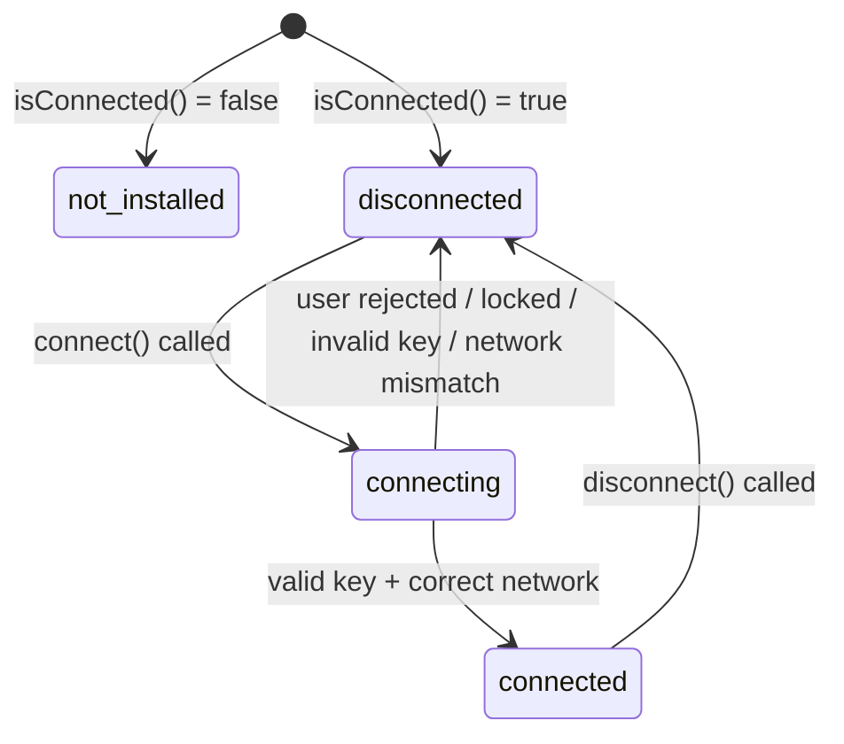

# Design Document: Freighter Wallet Integration

## Overview

This feature integrates the `@stellar/freighter-api` browser extension wallet into AjoSave so that users can connect their Freighter wallet and have their Stellar public key auto-populated in the Edit Profile form and the Join Circle form. Users without Freighter installed retain the existing manual text-entry experience unchanged.

The integration is entirely client-side. No backend changes are required. A shared custom hook (`useFreighterWallet`) encapsulates all Freighter API interactions, and a shared `ConnectWalletButton` component renders the appropriate UI based on connection state. Both the Profile page and the Join Circle form consume the hook and component independently, with no shared global state between instances.

### Key Design Decisions

- **Hook-per-instance isolation**: Each form mounts its own `useFreighterWallet` instance. This avoids cross-form state contamination and keeps the hook stateless at the module level.
- **`requestAccess` as the connect entry point**: The Freighter API's `requestAccess()` both prompts for permission and returns the public key in one call, making it the right choice for the connect flow. `isConnected()` is used only for the mount-time detection check.
- **Network validation via `getNetwork()`**: After `requestAccess()` succeeds, the hook calls `getNetwork()` to verify the user is on the expected network (Pubnet/PUBLIC) before accepting the key.
- **No `@stellar/stellar-sdk` for wallet connectivity**: The SDK is already installed for other purposes; the hook imports exclusively from `@stellar/freighter-api`.
- **Pinned exact version**: `@stellar/freighter-api` is pinned to `3.1.0` (the latest stable release compatible with the v6 API surface documented at docs.freighter.app) to ensure reproducible builds.

---

## Architecture

The feature adds three new files and modifies two existing ones:

```
src/
  hooks/
    useFreighterWallet.ts          ← new: shared hook
  components/
    wallet/
      ConnectWalletButton.tsx      ← new: shared button component
      ConnectWalletButton.module.css ← new: styles
  app/
    profile/
      page.tsx                     ← modified: wire up hook + button
  components/
    circle/
      JoinCircleForm.tsx           ← modified: wire up hook + button
```

### Data Flow

```mermaid
sequenceDiagram
    participant User
    participant Form (Profile or Join)
    participant useFreighterWallet
    participant ConnectWalletButton
    participant @stellar/freighter-api

    Form->>useFreighterWallet: mount → detect()
    useFreighterWallet->@stellar/freighter-api: isConnected()
    @stellar/freighter-api-->>useFreighterWallet: { isConnected: true/false }
    useFreighterWallet-->>Form: connectionState = 'disconnected' | 'not_installed'

    User->>ConnectWalletButton: click "Connect Wallet"
    ConnectWalletButton->>useFreighterWallet: connect()
    useFreighterWallet-->>Form: connectionState = 'connecting'
    useFreighterWallet->@stellar/freighter-api: requestAccess()
    @stellar/freighter-api-->>useFreighterWallet: { address } | { error }
    useFreighterWallet->@stellar/freighter-api: getNetwork()
    @stellar/freighter-api-->>useFreighterWallet: { network }
    useFreighterWallet-->>Form: connectionState = 'connected', publicKey = address
    Form-->>Form: setForm({ stellarPublicKey: publicKey })
```

### Connection State Machine



---

## Components and Interfaces

### `useFreighterWallet` Hook

**File**: `src/hooks/useFreighterWallet.ts`

```typescript
export type ConnectionState =
  | "not_installed"
  | "disconnected"
  | "connecting"
  | "connected";

export interface UseFreighterWalletReturn {
  connectionState: ConnectionState;
  publicKey: string | null;
  error: string | null;
  connect: () => Promise<void>;
  disconnect: () => void;
}

export function useFreighterWallet(): UseFreighterWalletReturn
```

**Behaviour contract**:

- On mount, calls `isConnected()` from `@stellar/freighter-api`. If it resolves `{ isConnected: true }`, sets state to `disconnected`. If `{ isConnected: false }` or the call throws, sets state to `not_installed` (and logs the error).
- `connect()`:
  1. Sets `connectionState` to `connecting`, clears `error`.
  2. Calls `requestAccess()`. On error, maps the error string to a user-facing message and sets `connectionState` to `disconnected`.
  3. Validates the returned `address`: must be exactly 56 characters and start with `G`. On failure, sets error and `connectionState` to `disconnected`.
  4. Calls `getNetwork()`. If the returned `network` is not `"PUBLIC"`, sets a network-mismatch error and `connectionState` to `disconnected`.
  5. On success, sets `publicKey` and `connectionState` to `connected`.
- `disconnect()`: Sets `connectionState` to `disconnected`, `publicKey` to `null`, `error` to `null`.

**Error message mapping**:

| Condition | Error message |
|---|---|
| User rejected prompt | `"Connection request was rejected. You can enter your Stellar key manually."` |
| Wallet locked | `"Your Freighter wallet is locked. Please unlock it and try again."` |
| Invalid public key | `"The key returned by Freighter is not a valid Stellar public key."` |
| Network mismatch | `"Freighter is connected to {detectedNetwork}, but this app requires Pubnet. Please switch networks in Freighter and try again."` |

**Error detection**: The Freighter API returns errors as a string in the `error` field of the response object. Rejection is detected by checking if the error string contains `"rejected"` or `"denied"` (case-insensitive). Locked wallet is detected by checking for `"locked"`.

---

### `ConnectWalletButton` Component

**File**: `src/components/wallet/ConnectWalletButton.tsx`

```typescript
interface ConnectWalletButtonProps {
  connectionState: ConnectionState;
  onConnect: () => void;
  onDisconnect: () => void;
  publicKey: string | null;
}

export function ConnectWalletButton(props: ConnectWalletButtonProps): JSX.Element
```

**Rendering rules by state**:

| `connectionState` | Renders |
|---|---|
| `not_installed` | Nothing (null) — the parent renders the install link |
| `disconnected` | "Connect Freighter Wallet" button (enabled) |
| `connecting` | "Connect Freighter Wallet" button (disabled, `aria-busy="true"`, `aria-disabled="true"`, spinner) |
| `connected` | "Disconnect" button + truncated key status (`role="status"`) |

The "Connect Freighter Wallet" button has `aria-label="Connect Freighter Wallet"` as its accessible name. The "Disconnect" button has `aria-label="Disconnect Freighter Wallet"`.

When `connected`, the status message reads: `"Connected: {first8}…{last4}"` where `first8` is `publicKey.slice(0, 8)` and `last4` is `publicKey.slice(-4)`.

---

### Profile Page Integration

**File**: `src/app/profile/page.tsx` (modified)

The existing `stellarPublicKey` input group is augmented:

1. `useFreighterWallet()` is called at the top of the component.
2. A `useEffect` watches `publicKey` from the hook: when it becomes non-null, it calls `setForm(f => ({ ...f, stellarPublicKey: publicKey }))`.
3. A second `useEffect` watches `disconnect`: when `connectionState` transitions to `disconnected` from `connected`, it clears the field (sets `stellarPublicKey` to `""`).
4. The `stellarPublicKey` input group renders:
   - The existing `<input>` (always present, always editable).
   - `<ConnectWalletButton>` (rendered when `connectionState !== 'not_installed'`).
   - Install helper text with link to `https://freighter.app` (rendered when `connectionState === 'not_installed'`).
   - Error message in `role="alert"` (rendered when `error` is non-null).

---

### Join Circle Form Integration

**File**: `src/components/circle/JoinCircleForm.tsx` (modified)

Same pattern as the Profile page:

1. `useFreighterWallet()` called at the top.
2. `useEffect` syncs `publicKey` → `setStellarPublicKey(publicKey)`.
3. `useEffect` clears field on disconnect.
4. The `stellarPublicKey` field group renders the same set of sub-elements as the Profile page.

---

## Data Models

### Connection State

```typescript
type ConnectionState = "not_installed" | "disconnected" | "connecting" | "connected";
```

### Hook Internal State

```typescript
interface WalletState {
  connectionState: ConnectionState;
  publicKey: string | null;
  error: string | null;
}
```

### Freighter API Response Types (from `@stellar/freighter-api`)

```typescript
// isConnected()
type IsConnectedResult = { isConnected: boolean } & { error?: string };

// requestAccess()
type RequestAccessResult = { address: string } & { error?: string };

// getNetwork()
type GetNetworkResult = { network: string; networkPassphrase: string } & { error?: string };
```

### Public Key Validation Rule

A Stellar public key is valid for this feature if and only if:
- `typeof key === 'string'`
- `key.length === 56`
- `key.startsWith('G')`

This matches the validation already used in `src/types/schemas.ts` (`z.string().length(56)`), extended with the `G` prefix check.

### Expected Network

The application expects `network === "PUBLIC"` (Pubnet). This value is compared case-insensitively against the string returned by `getNetwork()`.

---

## Correctness Properties

*A property is a characteristic or behavior that should hold true across all valid executions of a system — essentially, a formal statement about what the system should do. Properties serve as the bridge between human-readable specifications and machine-verifiable correctness guarantees.*

This feature involves React hook logic with clear input/output behavior (key validation, state transitions, error message formatting) that is well-suited to property-based testing. The project uses Jest + `@testing-library/react`; the property-based testing library **fast-check** will be added as a dev dependency to implement these properties.

---

### Property 1: Valid public keys are always accepted

*For any* string that is exactly 56 characters long and begins with `G`, when `requestAccess()` is mocked to return that string as the address and `getNetwork()` returns `"PUBLIC"`, the hook SHALL set `connectionState` to `"connected"` and `publicKey` to that string.

**Validates: Requirements 4.5, 2.5, 3.4**

---

### Property 2: Invalid public keys are always rejected

*For any* string that either is not exactly 56 characters long or does not begin with `G`, when `requestAccess()` is mocked to return that string as the address, the hook SHALL set `connectionState` to `"disconnected"` and set a non-null `error`.

**Validates: Requirements 4.5, 4.6**

---

### Property 3: Network mismatch error names both networks

*For any* network name string that is not `"PUBLIC"` (case-insensitive), when `getNetwork()` returns that network name after a successful `requestAccess()`, the hook SHALL set `connectionState` to `"disconnected"` and the `error` string SHALL contain both the detected network name and the word `"Pubnet"`.

**Validates: Requirements 7.1, 7.2**

---

### Property 4: Error messages always appear in a role="alert" element

*For any* non-empty error string set on the hook, when `ConnectWalletButton` or the parent form renders with that error, the error text SHALL appear inside a DOM element with `role="alert"`.

**Validates: Requirements 9.3**

---

### Property 5: Connected status always shows correct key truncation

*For any* valid Stellar public key (56 chars, starts with `G`), when the hook is in `"connected"` state with that key, the rendered status message SHALL contain the first 8 characters of the key and the last 4 characters of the key.

**Validates: Requirements 9.4**

---

## Error Handling

### Freighter Not Installed

Detected at mount via `isConnected()` returning `{ isConnected: false }` or throwing. The hook sets `connectionState` to `not_installed`. The UI renders the manual input with an install link. No error message is shown — the install link is informational, not an error.

### User Rejects Permission Prompt

`requestAccess()` returns `{ error: "..." }` where the error string contains `"rejected"` or `"denied"`. The hook maps this to the rejection message and sets `connectionState` to `disconnected`. The Connect button re-enables. Calling `connect()` again clears the error before retrying.

### Wallet Locked

`requestAccess()` returns an error containing `"locked"`. The hook maps this to the locked-wallet message and sets `connectionState` to `disconnected`.

### Invalid Public Key

After `requestAccess()` succeeds, the returned `address` fails the 56-char / `G`-prefix validation. The hook sets an error and `connectionState` to `disconnected`. The raw invalid key is never written to the form field.

### Network Mismatch

After `requestAccess()` succeeds and key validation passes, `getNetwork()` returns a network other than `"PUBLIC"`. The hook sets the mismatch error (naming both networks) and `connectionState` to `disconnected`. The key is not written to the form field.

### Unexpected Errors

Any unhandled exception in `connect()` is caught, logged to `console.error`, and results in a generic error message: `"An unexpected error occurred. Please try again."` with `connectionState` set to `disconnected`.

### SSR Safety

`@stellar/freighter-api` accesses `window` and browser extension APIs. The hook must guard against SSR by checking `typeof window !== 'undefined'` before calling any Freighter API function. In Next.js 14, the hook is only used in `"use client"` components, but the guard is included defensively.

---

## Testing Strategy

The project uses Jest 29 + `@testing-library/react` 16. **fast-check** will be added as a dev dependency for property-based tests.

### Unit Tests — `useFreighterWallet` Hook

Test file: `src/hooks/__tests__/useFreighterWallet.test.ts`

All Freighter API functions are mocked via `jest.mock('@stellar/freighter-api')`.

**Example-based tests** (one test per scenario):
- Mount with `isConnected()` → `true`: state becomes `disconnected`
- Mount with `isConnected()` → `false`: state becomes `not_installed`
- Mount with `isConnected()` throwing: state becomes `not_installed`, `console.error` called
- `connect()` transitions through `connecting` → `connected` on success
- `connect()` on rejection: state → `disconnected`, correct error message
- `connect()` on locked wallet: state → `disconnected`, correct error message
- `connect()` on network mismatch: state → `disconnected`, error names both networks
- `disconnect()` resets state and publicKey to null
- Two hook instances are independent (no shared state)
- Calling `connect()` after rejection clears the previous error

**Property-based tests** (fast-check, minimum 100 iterations each):

```
// Feature: freighter-wallet, Property 1: Valid public keys are always accepted
fc.assert(fc.property(
  fc.string({ minLength: 55, maxLength: 55 }).map(s => 'G' + s),
  async (validKey) => { ... }
))

// Feature: freighter-wallet, Property 2: Invalid public keys are always rejected
fc.assert(fc.property(
  fc.oneof(
    fc.string().filter(s => s.length !== 56),
    fc.string({ minLength: 56, maxLength: 56 }).filter(s => !s.startsWith('G'))
  ),
  async (invalidKey) => { ... }
))

// Feature: freighter-wallet, Property 3: Network mismatch error names both networks
fc.assert(fc.property(
  fc.string().filter(s => s.toUpperCase() !== 'PUBLIC'),
  async (network) => { ... }
))
```

### Unit Tests — `ConnectWalletButton` Component

Test file: `src/components/wallet/__tests__/ConnectWalletButton.test.tsx`

**Example-based tests**:
- Renders nothing when `connectionState === 'not_installed'`
- Renders enabled button with accessible name "Connect Freighter Wallet" when `disconnected`
- Renders disabled button with `aria-busy="true"` and `aria-disabled="true"` when `connecting`
- Renders "Disconnect" button and status message when `connected`
- Calls `onConnect` when Connect button is clicked
- Calls `onDisconnect` when Disconnect button is clicked
- Connect and Disconnect buttons are keyboard-operable (respond to Enter/Space)

**Property-based tests**:

```
// Feature: freighter-wallet, Property 4: Error messages always appear in a role="alert" element
fc.assert(fc.property(
  fc.string({ minLength: 1 }),
  (errorMessage) => { ... }
))

// Feature: freighter-wallet, Property 5: Connected status always shows correct key truncation
fc.assert(fc.property(
  fc.string({ minLength: 55, maxLength: 55 }).map(s => 'G' + s),
  (validKey) => { ... }
))
```

### Integration Tests — Profile Page

Test file: `src/app/profile/__tests__/page.test.tsx`

Mocks: `useFreighterWallet` hook, `next-auth/react`, `next/navigation`, `fetch`.

- When hook returns `not_installed`: no Connect button, install link present
- When hook returns `disconnected`: Connect button present alongside input
- When hook returns `connected` with a key: input value equals the key, Disconnect control present
- Connecting auto-populates the `stellarPublicKey` input
- Disconnecting clears the `stellarPublicKey` input
- Error from hook renders in `role="alert"` element
- Form submits with the wallet-provided key unchanged

### Integration Tests — Join Circle Form

Test file: `src/components/circle/__tests__/JoinCircleForm.test.tsx`

Same scenarios as Profile page integration tests, adapted for the Join Circle form context.

### Accessibility Tests

Covered within the component unit tests using `@testing-library/react`'s accessibility queries (`getByRole`, `getByLabelText`). No separate accessibility test file is needed.

### What Is Not Tested

- Actual Freighter browser extension behaviour (tested by the Freighter team)
- The `npm install` step (verified by CI build)
- Visual appearance and CSS (out of scope for unit tests)
