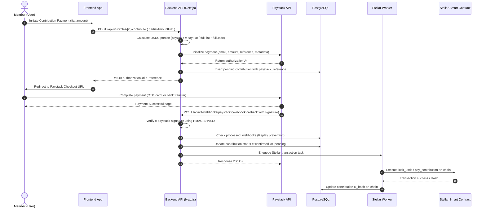

# Paystack NGN On-Ramp to USDC Conversion Flow

This document details the end-to-end flow of how local currency deposits (NGN paid via Paystack) are initialized, verified, converted to USDC, and locked in the smart contract on-chain.

## 1. Sequence Diagram

## 2. Technical Details & Architecture

### Exchange Rate Source
* **Live Feed**: Fetched dynamically via `https://open.er-api.com/v6/latest/USD` in `src/lib/fx.ts`.
* **Caching**: Cached using Redis key `fx:per_usdc:[CURRENCY]` with a **TTL of 300 seconds (5 minutes)**.
* **Fallbacks**: If the live feed fails, a database-level last-known rate is retrieved. If that's unavailable, hardcoded fallback rates (e.g., `NGN = 1600`) are used.

### Rate Lock & Slippage
* **Zero Slippage Risk**: When a circle cycle is initiated or a contribution target is set, the conversion rate is **locked** in the database according to the circle's contribution parameters (`contributionFiat` / `contributionUsdc` ratio).
* **Payment Window**: Once a payment is initialized, the rate is locked for the duration of the Paystack checkout session using the unique `paystack_reference` reference key, ensuring no volatility exposure to the member.
* **Precision Handling**: Fractional USDC values are converted to 7-decimal places and tracked as integers (**Stroops** where `1 USDC = 10,000,000 Stroops`) in backend calculations and on-chain Soroban contracts.

## 3. Onboarding & Help Content (User-Facing)

To maintain transparency, members see the following guidelines in onboarding/help FAQs:
* **How are conversion rates calculated?** Rates are calculated based on international forex feeds (updated every 5 minutes). When you pay NGN, the rate is fixed at the start of the deposit flow.
* **Are there slippage fees?** No. The rate you see at checkout is exactly what is used to credit your contribution. Any intraday volatility is absorbed by the vault cushion.
* **Where does my USDC go?** Once Paystack confirms the payment, our worker automatically locks the USDC equivalent on-chain inside the circle's Soroban smart contract.
